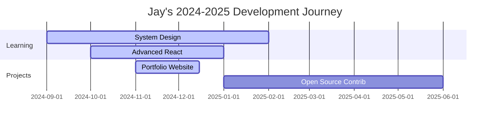

<!-- Animated Header with Gradient -->
<div align="center">
  
</div>

<!-- Dynamic Typing Animation -->
<div align="center">
  
</div>

<!-- Animated Divider -->
<div align="center">
  
</div>

## 🎯 About Me

<div align="center">
  <table>
    <tr>
      <td width="50%">
        
### 👨‍💻 Current Focus
```yaml
Name: Jay Kolate
Role: Full Stack Developer
Education: Computer Engineering (2023–2027) @ SIT, Pune
Status: Learning & Building Cool Stuff 🚀
Current: Exploring Advanced React Patterns & System Design
```

### 🎪 Fun Facts
- 🐛 I debug with console.log and I'm proud of it!
- ☕ Coffee-driven development is my superpower
- 🎮 When not coding, I'm probably gaming or exploring new tech
- 🌱 Believer in sustainable tech and green coding practices

      </td>
      <td width="50%">
        <div align="center">
          
        </div>
      </td>
    </tr>
  </table>
</div>

<!-- Interactive Tech Stack -->
<div align="center">
  
</div>

## 🛠️ Tech Arsenal & Skills

<div align="center">

### 🔥 Core Technologies


### ⚡ Tools & Platforms


</div>

<!-- Animated Section Divider -->
<div align="center">
  
</div>

## 🚀 Featured Projects

<div align="center">
  <table>
    <tr>
      <td width="50%">
        
### 📊 Advanced Student Monitoring System
<div align="center">
  
  
  
</div>

🎯 **Smart Performance Tracker**
- Automated report generation
- Email & WhatsApp integration
- Data visualization dashboard
- Performance analytics

📋 [Documentation](https://drive.google.com/file/d/1zQJfDUogGDRSEm8IMY3YyXyhLW52tylw/view?usp=sharing) | 🔗 [Demo](#)

      </td>
      <td width="50%">
        
### 👕 ReWear – Sustainable Fashion Platform
<div align="center">
  
  
  
  
</div>

♻️ **Eco-Friendly Fashion Hub**
- Clothing exchange marketplace
- Carbon footprint tracking
- Donation management
- Sustainable shopping rewards

🌐 [Live Demo](#) | 💻 [Source Code](#)

      </td>
    </tr>
    <tr>
      <td width="50%">
        
### 📚 NoteShare – Learning Platform
<div align="center">
  
  
  
</div>

📖 **Collaborative Knowledge Hub**
- Note sharing & rating system
- Advanced search functionality
- User collaboration features
- Academic resource management

📱 [Try it out](#) | 🎥 [Demo Video](#)

      </td>
      <td width="50%">
        
### ✅ Smart To-Do Application
<div align="center">
  
  
  
</div>

📝 **Productivity Enhancement Tool**
- Task management system
- User authentication
- Progress tracking
- Deadline reminders

🔗 [Live Demo](#) | 💻 [Source Code](https://github.com/JayKolate/todo-list-app)

      </td>
    </tr>
  </table>
</div>

<!-- GitHub Stats Section -->
<div align="center">
  
</div>

## 📊 GitHub Analytics

<div align="center">
  
### 🔥 Contribution Stats


### 🔥 Streak Stats


### 📈 Activity Graph


</div>

<!-- Achievements Section -->
<div align="center">
  
</div>

## 🏆 Achievements & Recognition

<div align="center">
  
### 🎖️ GitHub Trophies


### 💪 LeetCode Progress


</div>

<!-- Connect Section with Animation -->
<div align="center">
  
</div>

## 🤝 Let's Connect & Collaborate!

<div align="center">
  
### 🌐 Find Me On
<a href="https://www.linkedin.com/in/jay-kolate-b97753304/">
  
</a>
<a href="mailto:jaykolate529@gmail.com">
  
</a>
<a href="https://github.com/JayKolate">
  
</a>

### 📊 Profile Views


</div>

<!-- Inspirational Quote -->
<div align="center">
  
</div>

## 💭 Daily Inspiration

<div align="center">
  
</div>

<!-- Interactive Elements -->
<div align="center">
  
### 🎯 Current Goals


</div>

<!-- Fun Interactive Snake -->
<div align="center">
  
### 🐍 Contribution Snake


</div>

<!-- Animated Footer -->
<div align="center">
  
</div>

<!-- Visitor Counter and Last Updated -->
<div align="center">
  
**⭐ Star this repository if you find it helpful!**  
**🔄 Last Updated:** `September 2025`  
**❤️ Made with passion and lots of ☕**

</div>
